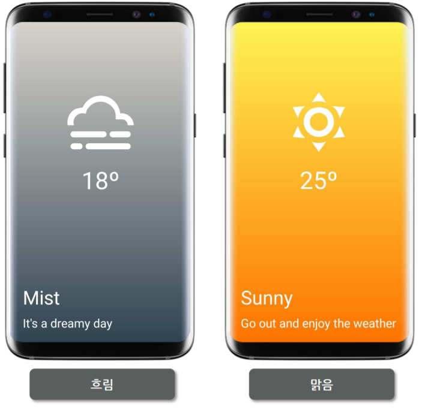

ReactNative - WeatherApp
===

## [??? ??]
? ??? ???? ??? ??? ???

## [?? ??]
- **??**: Node.js (express)
- **?? ?????/API**
 : Expo / FlexBox
 
## [?? ?? ??]

#### 1-2.What are we using
    ReactNative, Expo.io ?????
	expo.io => ??? ???? ?? ?? ??? ? ?? ???.
	
	
#### 1-3.Requirments

	nodejs
	npm
	editor (Visual Studio Code, Atom)
	
#### 1-4. What is ReactNative
	
	??? ????
	-???? ? ??????? ???? ???? UI ?????
	-??? ????? html, css ??????? ???? ???. 
	-html, css ?? ??? ??? ????, ????? ?? ???? ?? ???????!
	-Objective-C? iOS? ?? ?, Java? Android? ?? ? => ??? ???? ? ?, ?? ios, android ???? ??? ??? ??! ??!
	-?? ??? ????? ??? ??????
		=>JSX, ??????? ??? ??, ? ??? ??????? objective-c ?? java? ???? ???. ????? ?? ??? ???!! ??!!!!!
		
		
		
	??
		1.??????? ??? ? ??? ?
		2.????? ??? ?
		3.?? ??? ??? ????? ?? ??? ?
			-?????, ?????, ????... ??: showcase react native
		4.??? ??? iOS-Android ? ?? ??? ??? ? ??? ?.
		
	2??? ????? ???? ??.
	https://facebook.github.io/react-native/

#### 1-5. What is Expo

	expo
	-??? ????? ?? ??? ?? ???. without Xcode, Android Studio
	-Xcode ?? ?? ?? ios? ?? ?????? ??.
	-???? xcode, android studio ??? ??? ??? ???, expo? ???? ??? ?? ??? ??.
	-expo? ?? iOS/Android ?? ???? ?? ?? ? ??. (? ???? ?? ??? ????.)
	-Expo Client? ?? ???? ?? ??? ??.
	
	-?? ???? ?, code push??? ??.
		?? ?????? ?? ?, review process, ???? ????? ??? ???? ? ????? ? ??.
		??? ?? ????? ? ???, ?? ??? ???? ????? ? ?? ????? ????..! AWESOME!
		
		??, ?? ??? ????. ?? ???? ?? ??? ? ?? ???? ???.....? ?...
		expo? ????? ???? ??? ?? ???, expo client? push? ??. =>??? client? ?? ???? ?? ??? ?????. 
		?, ??? ?? ??? ???? ?? ???. ?? ????? ???? ??? ??? ??? ???? ???.\
		
#### 1-6. Installing Expo and Creating a new Project

	Expo XDE ???? ???
	https://docs.expo.io/versions/latest/introduction/installation
	
	Expo XDE deprecated ?.
	CLI ?? ???
	# npm install -g expo-cli
	# yarn global add expo-cli
	
	# expo init
	# expo start

	XDE? ???? ?, create project ?? 
		-React Native? ??? npm, yarn ?? ?? ???.
		
	?? ????? ????, Device => ??? ? ?? ??
	
	HotReloading ??? ? ????.
	-??? ????, ??? ??? ??? ??? ??. (??? ?? ???!)
	-Killer Ficture !!
	
	*????? ?????? ?????.
	
#### 2-1. Basic React Native Concepts
	
	??? ????? ?? ??? 
,  ?.. <html>? ??? ?!
	=>?, ??? return ? ? ?? ????? ??? ??? ???.
	=>??? ?? ??? ?????, ??? ?? ???? ?? ???? ??.
	??? ????? ????? ??? ??? ?? ?????? ???.
	<view> ????? ???? ? ??? ??? ?? ???.
	
	Expo Snack? ???? ????? ?? ??? ???? ??? ??? ?? ? ??.
	https://snack.expo.io/
	
	??? ????? ???? FlexBox? ????? ?? ? ? ??.
	-CSS? FlexBox
	
	*??? ????? ??? ????.
	-??? ?? ??? ?? ??? ????. ??? ?? ??. (???? html ?? ?? ?? ???)
	-?? ?????? ??? ??. (??? ??) ??? ? ??? ???!
	
	*??? ???? ?? ??
	1.????? import
	2.css? ??? style? ??
	3.??? ??? ??? ?.
	
#### 2-2. React Native Layouts with Flexbox

	FlexBox? ???? ??? ??? ?? ??? ??! (? ?????) -?? css? ? ?? ???
	flex => ??? ??? ?? ??? ????? ??
	flexDirection? ???? column??.
	justifyContent: "center", "flex-start", "flex-end", "space-between", "space-around"
	alignItems:"center", "flex-end", 
	alignSelf: "flex-start", "center",
	flexWrap:'wrap, 'nowrap'
	
	??? css? ???? ??? ????? ?. ?????? ??? ????? ?? ????.
	
	??? ???? + FlexBox? ??? ????!
	
#### 3-1. Building the Loading View

	??? ????? ?? ?? ?, ?? local state?? ???? ??.
	(redux? ?? state management ????? => ?? ???? state, data, screen? ???? ??? ?? ??)
	
	???? state? ??????.
	
	??? ???? ????, ????? ????? indicator? ????.
	=>state ={ isLoaded:false } => ???? ???? ???? ????? ?? ??.
	
	??? ??????? short hand property? ???? ???. 
	padding: "40 30 50 60"
	
	1.???? ?? state? ???, isLoaded: false ?? ?? => ??? API? ???? ??, ? ?? true? ??? ?.
	2.FlexBox? ??? ??
	
#### 3-2. Building the Weather View

	LinearGradient 
	=> expo?? ??. (??? ???? ?? ??? ?? ?? Linear Gradient ??.)

#### 3-3. Working with icons

	status bar ??
	=>???? ???, ??? ?? ? ??.
	
	ion icon? ??? ?? ????? ??. ??? ??? ??? ??
	https://expo.github.io/vector-icons/
	
	expo?? ???? ??? ?? ???
	-ion icon, font awesome icon ..
	-??, expo ???? ???? ????, npm?? yarn?? ???? ?? ?????? ??.
	<Ionicons color, size, name/>
	
#### 3-4. Getting Geolocation

	navigator?? object? ??? ?? ???? ???.

#### 3-5. Handling Error on Geolocation

	?? ??? ???? ??, ???? ??? ???? ??
	??? state? ??
	
#### 4-1. Getting the weather
	
	API ??.
	-??? ?? API? open weather map ? ?.
	https://openweathermap.org/
	
	???? ? API key ??:
	e2ba3d8c096a5769bcaf8f19a872a48f
	
	json parameter? ??? ?? ??? ???? ? ?? -> json respond parameters? weather ?? => more info Weather condition codes ??=> https://openweathermap.org/weather-conditions => ?? ???? ? ????.
	
	*??? ?? (ctrl + D)
	-??? ?? ???? ???? ??. ???? ???? ? ? ? ??.
	
	
#### 4-2. Hooking the component to the weather data

	??? ??? ???? ?? ??.
	Math.floor 
	=> 123.11 => 123?? ???? ??
	
	Math.ceil
	=> 1.78 => 2 (???)

#### 5-1. Changing the icons and testing on iOS

	QuickTimePlayer (??? ???? ????? ??)

## [????]
* [??? ??](https://nomadcoders.co/)